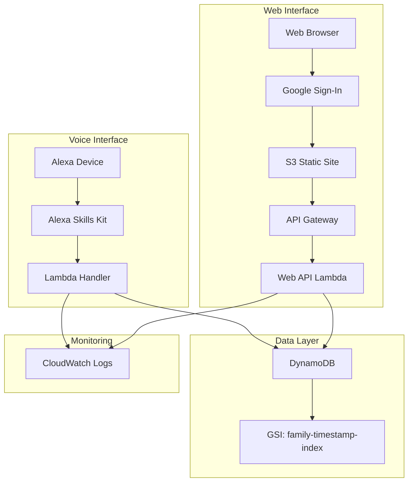

# Alexa Voice Memo

音声でメモを管理できるAlexaスキル - AWS CDK + DynamoDB + Lambda構成

## 🎯 プロジェクト概要

**開発ステータス**: 全機能実装完了 ✅  
**稼働状況**: AWS本番環境で動作中  
**実装期間**: 初期実装17分（2025-07-12）+ Web UI・家族機能（2025-07-13〜14）

### 主要機能

#### Alexaスキル
- ✅ **メモ追加**: 「牛乳を買うをメモして」
- ✅ **メモ読み上げ**: 「メモを読んで」
- ✅ **メモ削除**: 「1番目のメモを削除して」

#### Web UI
- ✅ **Google Sign-In認証**: Googleアカウントでログイン
- ✅ **メモ管理**: 追加・編集・削除・復元
- ✅ **音声入力**: Web Speech APIによる音声メモ追加
- ✅ **家族共有機能**: 
  - 招待コード（4桁）で家族を招待
  - 家族間でメモを共有
  - 当主（とうしゅ）による家族管理
  - 家督譲渡（かとくじょうと）機能
  - メモの自動統合・分離

### 技術スタック
- **インフラ**: AWS CDK v2 (TypeScript)
- **データベース**: DynamoDB (オンデマンド)
- **ランタイム**: Lambda Node.js 20.x
- **開発言語**: TypeScript

## 📋 前提条件

- **Node.js**: v20.x以上
- **npm**: v10.x以上
- **AWS CLI**: v2.x（設定済み）
- **AWS CDK**: v2.x
- **AWSアカウント**: 管理者権限または以下の権限を持つIAMユーザー
  - CloudFormation、Lambda、DynamoDB、API Gateway、S3、IAMの作成権限

### 必要なツールのインストール
```bash
# AWS CDKのインストール
npm install -g aws-cdk

# AWS CLIの設定確認
aws configure list

# 設定されていない場合
aws configure
```

## 🚀 クイックスタート

### 1. 環境設定
```bash
# リポジトリのクローン
git clone https://github.com/your-username/alexa-voice-memo.git
cd alexa-voice-memo

# 依存関係インストール
npm install

# 環境変数設定
export CDK_ACCOUNT=your-aws-account-id
export CDK_REGION=ap-northeast-1
export CDK_ENV=dev

# CDK Bootstrap（初回のみ）
cdk bootstrap aws://${CDK_ACCOUNT}/${CDK_REGION}
```

### 2. Google Sign-In 設定（Web UI用）

#### 2.1 Google Cloud Console での設定
1. [Google Cloud Console](https://console.cloud.google.com/) にアクセス
2. 新規プロジェクトを作成（または既存プロジェクトを選択）
3. **OAuth同意画面** の設定
   - **APIとサービス** → **OAuth同意画面** を開く
   - ユーザータイプ: **外部** を選択
   - アプリ情報を入力:
     - アプリ名: `Voice Memo`
     - ユーザーサポートメール: あなたのメールアドレス
     - 開発者連絡先情報: あなたのメールアドレス
   - スコープは追加不要（基本プロフィールのみ使用）
   - テストユーザーを追加（必要に応じて）
4. **認証情報** → **認証情報を作成** → **OAuth クライアント ID**
5. 以下の設定を行う：
   - アプリケーションの種類: **ウェブアプリケーション**
   - 名前: `Voice Memo Web`
   - 承認済みの JavaScript 生成元:
     - `http://localhost:8080` （開発用）
     - `http://alexa-voice-memo-dev-frontend.s3-website-ap-northeast-1.amazonaws.com` （S3開発環境）
     - `https://your-domain.com` （本番用）
6. **作成** をクリックしてクライアントIDを取得

#### 2.2 アプリケーションへの設定
```bash
# 環境別設定ファイルの作成
cp .env.example .env.dev

# 開発環境のGoogle Client IDを設定
# .env.dev ファイルを編集:
GOOGLE_CLIENT_ID_DEV=123456789012-abcdefghijklmnopqrstuvwxyz.apps.googleusercontent.com
CDK_ACCOUNT=your-aws-account-id
CDK_REGION=ap-northeast-1
CDK_ENV=dev

# 本番環境用の場合
cp .env.example .env.prod
# .env.prod に本番用のClient IDを設定
```

### 3. デプロイ
```bash
# 全コンポーネントのビルド
npm run build:all

# CDKデプロイ（バックエンド）
cdk deploy alexa-voice-memo-dev

# デプロイ出力からLambda ARNをコピー
# 例: arn:aws:lambda:ap-northeast-1:123456789012:function:alexa-voice-memo-dev-handler

# フロントエンドビルド（環境別）
npm run build:frontend:dev   # 開発環境
npm run build:frontend:stg   # ステージング環境  
npm run build:frontend:prod  # 本番環境

# フロントエンドデプロイ（S3）
npm run deploy:frontend
```

### 4. Alexaスキルの設定

#### 4.1 Alexa Developer Consoleでの設定
1. [Alexa Developer Console](https://developer.amazon.com/alexa/console/ask) にアクセス
2. **スキルの作成** をクリック
3. 以下を設定：
   - スキル名: `ボイスメモ`
   - デフォルトの言語: `日本語（日本）`
   - モデルを選択: `カスタム`
   - ホスティング方法: `ユーザー定義のプロビジョニング`
4. **スキルを作成** をクリック

#### 4.2 対話モデルの設定
1. **対話モデル** → **JSONエディター** を開く
2. `alexa-skills/interaction-model.json` の内容をコピー＆ペースト
3. **モデルを保存** → **モデルをビルド** をクリック

#### 4.3 エンドポイントの設定
1. **エンドポイント** を開く
2. **AWS LambdaのARN** を選択
3. デフォルトの地域に、CDKデプロイで取得したLambda ARNを入力
4. **エンドポイントを保存** をクリック

#### 4.4 テスト
1. **テスト** タブを開く
2. テスト環境を **開発中** に設定
3. 「ボイスメモを開いて」と入力してテスト

### 4. テスト実行
```bash
# Lambda関数テスト
aws lambda invoke --function-name alexa-voice-memo-dev-handler \
  --payload file://test/fixtures/test-add-memo.json \
  test/responses/response.json
```

## 📁 プロジェクト構造

```
alexa-voice-memo/
├── src/                    # Lambda ソースコード
│   ├── handler.ts         # Alexaスキルハンドラー
│   ├── memo-service.ts    # DynamoDB操作
│   └── common/            # 共通コード
│       ├── services/      # 共通サービス
│       │   └── user-service.ts
│       ├── types/         # 型定義
│       └── config/        # 設定
│           └── constants.ts
├── lib/                    # CDK インフラ定義
│   ├── alexa-voice-memo-stack.ts
│   └── alexa-voice-memo-stack.WebApiHandler.ts # Web API
├── public/                 # Web UI
│   ├── index.html
│   ├── styles.css
│   └── app.js
├── scripts/                # 運用スクリプト
│   ├── build-frontend.js
│   ├── build-web-api.js
│   └── fix-family-integration.js
├── test/
│   ├── memo-service.test.ts
│   ├── user-service.test.ts
│   ├── fixtures/          # テスト入力データ
│   └── responses/         # テスト実行結果
├── docs/                   # プロジェクトドキュメント
│   ├── current-status.md
│   ├── cdk-specification.md
│   ├── refactoring-plan.md
│   └── lessons-learned/
│       └── family-sharing-debug.md
└── bin/                    # CDK エントリーポイント
    └── alexa-voice-memo.ts
```

## 🛠️ 開発コマンド

### ビルドコマンド
```bash
npm run build          # TypeScript コンパイル
npm run build:all      # 全コンポーネントビルド（Lambda + Web API）
npm run build:web-api  # Web APIのみビルド
npm run watch          # ファイル監視モード
npm test               # Jest テスト実行
```

### CDK操作
```bash
cdk diff               # デプロイ予定変更確認
cdk deploy             # スタックデプロイ
cdk destroy            # リソース削除
```

### Lambda テスト
```bash
# メモ追加テスト
aws lambda invoke --function-name alexa-voice-memo-dev-handler \
  --payload file://test/fixtures/test-add-memo.json \
  test/responses/add-memo.json

# メモ読み上げテスト  
aws lambda invoke --function-name alexa-voice-memo-dev-handler \
  --payload file://test/fixtures/test-read-memos.json \
  test/responses/read-memos.json
```

## 🗄️ データベース構造

### DynamoDBテーブル: `alexa-voice-memo-dev-memos`
```json
{
  "userId": "amzn1.ask.account.test-user-123",    // パーティションキー
  "memoId": "memo_20250712_001",                  // ソートキー
  "text": "牛乳を買う",                            // メモ内容
  "timestamp": "2025-07-12T16:15:54.854Z",       // 作成日時
  "deleted": "false",                             // 削除フラグ
  "familyId": "google-oauth2|123456789",          // 家族ID（初期値=userId）
  "createdBy": "google-oauth2|123456789",         // 作成者ID
  "createdByName": "太郎",                         // 作成者名
  "updatedAt": "2025-07-12T16:15:54.854Z"
}
```

### グローバルセカンダリインデックス
- **family-updatedAt-index**: 家族単位での最新メモ取得

### 家族管理の設計思想
- **familyId = userId**: 初期状態では自分のIDが家族ID
- **簡単離婚システム**: 退出すると自分のfamilyIdに戻るだけ
- **招待コード**: 4桁数字、5分で自動失効
- **当主制度**: 家族の管理者（当主）が家督譲渡可能
- **動的メニュー**: ユーザーの状態に応じてメニュー項目が自動変更

## 💰 運用コスト

**月額想定費用**: $0.03未満

- DynamoDB: $0.01未満 (オンデマンド)
- Lambda: $0.01未満 (実行時間ベース)
- CloudWatch: $0.01未満 (ログ保存)

## 📊 実装状況

| 機能 | 実装 | テスト | 状況 |
|------|------|--------|------|
| LaunchRequest | ✅ | ✅ | 完了 |
| AddMemoIntent | ✅ | ✅ | 完了 |
| ReadMemosIntent | ✅ | ✅ | 完了 |
| DeleteMemoIntent | ✅ | ✅ | 完了 |
| HelpIntent | ✅ | ✅ | 完了 |
| Cancel/StopIntent | ✅ | ✅ | 完了 |
| **実機テスト** | ✅ | ✅ | **Echo動作確認済み** |

## 🔗 開発ロードマップ

### ✅ Phase 1: Infrastructure First (完了)
- [x] AWS CDK インフラ構築
- [x] DynamoDB + Lambda + IAM 設定
- [x] 初回デプロイ・動作確認

### ✅ Phase 2: Core Lambda Implementation (完了)
- [x] 全機能実装完了
- [x] エラーハンドリング実装
- [x] 複数メモテスト完了

### ✅ Phase 3: Testing & Polish (完了)
- [x] 全機能テスト完了
- [x] 実機動作確認
- [x] パフォーマンス確認

### ✅ Phase 4: Alexa Integration (完了)
- [x] Alexa Skills Kit 設定完了
- [x] 実機テスト完了
- [x] Echo デバイス動作確認

### ✅ Phase 5: Web UI & Family Features (完了)
- [x] Google Sign-In認証実装
- [x] Web UIでのメモ管理機能
- [x] 家族共有機能（招待・参加・退出）
- [x] 音声入力機能（Web Speech API）

### 🚀 Next: Optional Enhancements
- [ ] Alexa Skills Store 公開申請
- [ ] アイコン・プライバシーポリシー作成
- [ ] 追加機能実装（カテゴリ分け等）

## 📚 ドキュメント

詳細なドキュメントは `docs/` ディレクトリを参照：

- **[current-status.md](docs/current-status.md)**: 現在の実装状況詳細
- **[cdk-specification.md](docs/cdk-specification.md)**: 技術仕様書
- **[development-guide.md](docs/development-guide.md)**: 開発ガイド
- **[family-features-guide.md](docs/family-features-guide.md)**: 家族共有機能の使い方ガイド
- **[family-concept-verification.md](docs/family-concept-verification.md)**: 家族機能設計検証
- **[lessons-learned/family-sharing-debug.md](docs/lessons-learned/family-sharing-debug.md)**: 開発の教訓

## 🏗️ アーキテクチャ



## 🔧 トラブルシューティング

### よくある問題

1. **デプロイエラー**: CDK Bootstrap未実行
   ```bash
   cdk bootstrap aws://ACCOUNT-ID/REGION
   ```

2. **Lambda実行エラー**: CloudWatch Logsを確認
   ```bash
   aws logs tail /aws/lambda/alexa-voice-memo-dev-handler --follow
   ```

3. **DynamoDBアクセスエラー**: IAMロール権限確認

4. **音声入力が使えない**: 
   - HTTPSでのアクセスが必要（ローカルホストは例外）
   - ブラウザの音声入力許可を確認
   - 対応ブラウザ（Chrome推奨）を使用

5. **家族機能のトラブル**:
   - 招待コードの有効期限（5分）を確認
   - 当主の退出は家督譲渡が必要
   - 詳細は[family-features-guide.md](docs/family-features-guide.md)参照

## 🤝 Contributing

1. Issueを作成
2. Feature branchを作成
3. 実装・テスト
4. Pull Request作成

## 📄 License

MIT License - 詳細は [LICENSE](LICENSE) ファイルを参照

---

**Project**: alexa-voice-memo  
**Created**: 2025-07-12  
**Methodology**: [ideanotes](https://github.com/goodsun/ideanotes) スモールスタート原則  
**Status**: 全機能実装完了 ✅