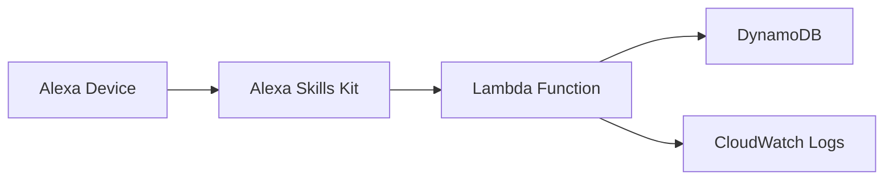

# Alexa Voice Memo

音声でメモを管理できるAlexaスキル - AWS CDK + DynamoDB + Lambda構成

## 🎯 プロジェクト概要

**開発ステータス**: Phase 1 完了 ✅  
**稼働状況**: AWS本番環境で動作中  
**実装期間**: 17分（2025-07-12）  

### 主要機能
- ✅ **メモ追加**: 「牛乳を買うをメモして」
- ✅ **メモ読み上げ**: 「メモを読んで」
- ✅ **メモ削除**: 「1番目のメモを削除して」（実装済み）

### 技術スタック
- **インフラ**: AWS CDK v2 (TypeScript)
- **データベース**: DynamoDB (オンデマンド)
- **ランタイム**: Lambda Node.js 20.x
- **開発言語**: TypeScript

## 🚀 クイックスタート

### 1. 環境設定
```bash
# 環境変数設定
export CDK_ACCOUNT=your-aws-account-id
export CDK_REGION=ap-northeast-1
export CDK_ENV=dev

# 依存関係インストール
npm install
```

### 2. デプロイ
```bash
# ビルド
npm run build

# デプロイ
cdk deploy alexa-voice-memo-dev
```

### 3. テスト実行
```bash
# Lambda関数テスト
aws lambda invoke --function-name alexa-voice-memo-dev-handler \
  --payload file://test/fixtures/test-add-memo.json \
  test/responses/response.json
```

## 📁 プロジェクト構造

```
alexa-voice-memo/
├── src/                    # Lambda ソースコード
│   ├── handler.ts         # メインハンドラー
│   ├── memo-service.ts    # DynamoDB操作
│   └── types.ts           # 型定義
├── lib/                    # CDK インフラ定義
│   └── alexa-voice-memo-stack.ts
├── test/
│   ├── fixtures/          # テスト入力データ
│   └── responses/         # テスト実行結果
├── docs/                   # プロジェクトドキュメント
│   ├── current-status.md  # 現状把握
│   ├── cdk-specification.md # 技術仕様
│   └── development-report-phase1.md # 開発報告
└── bin/                    # CDK エントリーポイント
    └── alexa-voice-memo.ts
```

## 🛠️ 開発コマンド

### CDK操作
```bash
npm run build          # TypeScript コンパイル
npm run watch          # ファイル監視モード
npm test               # Jest テスト実行
cdk diff               # デプロイ予定変更確認
cdk deploy             # スタックデプロイ
cdk destroy            # リソース削除
```

### Lambda テスト
```bash
# メモ追加テスト
aws lambda invoke --function-name alexa-voice-memo-dev-handler \
  --payload file://test/fixtures/test-add-memo.json \
  test/responses/add-memo.json

# メモ読み上げテスト  
aws lambda invoke --function-name alexa-voice-memo-dev-handler \
  --payload file://test/fixtures/test-read-memos.json \
  test/responses/read-memos.json
```

## 🗄️ データベース構造

### DynamoDBテーブル: `alexa-voice-memo-dev-memos`
```json
{
  "userId": "amzn1.ask.account.test-user-123",    // パーティションキー
  "memoId": "memo_20250712_001",                  // ソートキー
  "text": "牛乳を買う",                            // メモ内容
  "timestamp": "2025-07-12T16:15:54.854Z",       // 作成日時
  "deleted": "false",                             // 削除フラグ
  "createdAt": "2025-07-12T16:15:54.854Z",
  "updatedAt": "2025-07-12T16:15:54.854Z",
  "version": 1
}
```

### グローバルセカンダリインデックス
- **timestamp-index**: 時系列でのメモ取得
- **status-index**: 削除ステータスでのフィルタリング

## 💰 運用コスト

**月額想定費用**: $0.03未満

- DynamoDB: $0.01未満 (オンデマンド)
- Lambda: $0.01未満 (実行時間ベース)
- CloudWatch: $0.01未満 (ログ保存)

## 📊 実装状況

| 機能 | 実装 | テスト | 状況 |
|------|------|--------|------|
| LaunchRequest | ✅ | ✅ | 完了 |
| AddMemoIntent | ✅ | ✅ | 完了 |
| ReadMemosIntent | ✅ | ✅ | 完了 |
| DeleteMemoIntent | ✅ | ✅ | 完了 |
| HelpIntent | ✅ | ✅ | 完了 |
| Cancel/StopIntent | ✅ | ✅ | 完了 |
| **実機テスト** | ✅ | ✅ | **Echo動作確認済み** |

## 🔗 開発ロードマップ

### ✅ Phase 1: Infrastructure First (完了)
- [x] AWS CDK インフラ構築
- [x] DynamoDB + Lambda + IAM 設定
- [x] 初回デプロイ・動作確認

### ✅ Phase 2: Core Lambda Implementation (完了)
- [x] 全機能実装完了
- [x] エラーハンドリング実装
- [x] 複数メモテスト完了

### ✅ Phase 3: Testing & Polish (完了)
- [x] 全機能テスト完了
- [x] 実機動作確認
- [x] パフォーマンス確認

### ✅ Phase 4: Alexa Integration (完了)
- [x] Alexa Skills Kit 設定完了
- [x] 実機テスト完了
- [x] Echo デバイス動作確認

### 🚀 Next: Optional Enhancements
- [ ] Alexa Skills Store 公開申請
- [ ] アイコン・プライバシーポリシー作成
- [ ] 追加機能実装（カテゴリ分け等）

## 📚 ドキュメント

詳細なドキュメントは `docs/` ディレクトリを参照：

- **[current-status.md](docs/current-status.md)**: 現在の実装状況詳細
- **[cdk-specification.md](docs/cdk-specification.md)**: 技術仕様書
- **[development-guide.md](docs/development-guide.md)**: 開発ガイド
- **[development-report-phase1.md](docs/development-report-phase1.md)**: Phase 1開発報告

## 🏗️ アーキテクチャ



## 🔧 トラブルシューティング

### よくある問題

1. **デプロイエラー**: CDK Bootstrap未実行
   ```bash
   cdk bootstrap aws://ACCOUNT-ID/REGION
   ```

2. **Lambda実行エラー**: CloudWatch Logsを確認
   ```bash
   aws logs tail /aws/lambda/alexa-voice-memo-dev-handler --follow
   ```

3. **DynamoDBアクセスエラー**: IAMロール権限確認

## 🤝 Contributing

1. Issueを作成
2. Feature branchを作成
3. 実装・テスト
4. Pull Request作成

## 📄 License

MIT License - 詳細は [LICENSE](LICENSE) ファイルを参照

---

**Project**: alexa-voice-memo  
**Created**: 2025-07-12  
**Methodology**: [ideanotes](https://github.com/goodsun/ideanotes) スモールスタート原則  
**Status**: Phase 1 Complete ✅