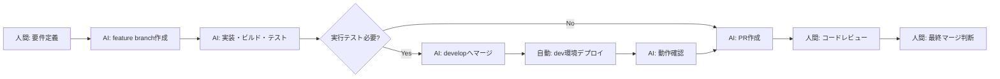

# AIサンドボックス開発方法論

*2025-01-14 alexa-voice-memo プロジェクトから生まれた学び*

## 🎯 概要

AI（Claude）との協働開発で最大の効率を実現する「**AIサンドボックス方法論**」。
深夜のAI開発で「包丁持ってても買い物忘れない」家族メモ機能を実装した経験から導き出された、人間＋AIの理想的な開発体制。

## 💡 きっかけ

```
人間「17分で家族メモ機能作って」
AI「（45分かけて実装）」
人間「おはよう、コミットしよう」
AI「プルリク作りました」
人間「あ、これだ！AIが自由に開発できる環境があれば...」
```

## 🏗️ AIサンドボックス環境の構築

### 1. 環境の分離

```
プロジェクト/
├── main (本番) ← AIは触れない
├── develop (開発) ← マージコミットのみ、自動デプロイ
└── feature/* ← AIの遊び場（全ての改修はここ）

AWS環境/
├── prod-stack ← AIは触れない
└── dev-stack ← developブランチから自動デプロイ
```

### 2. 権限設定

| 項目 | AI権限 | 備考 |
|------|--------|------|
| featureブランチ作成 | ✅ | 無制限 |
| featureへのプッシュ | ✅ | 自動実行 |
| ビルド・テスト | ✅ | 何度でもリトライ |
| developへのマージ | ✅ | 実行テストが必要な場合のみ |
| PR作成 | ✅ | developへ |
| developへの直接プッシュ | ❌ | マージコミットのみ |
| mainプッシュ | ❌ | 人間のみ |
| 本番デプロイ | ❌ | 人間のみ |

### 3. ワークフロー

#### 基本フロー


#### 重要なルール
1. **全ての改修はfeatureブランチで行う**
2. **実行テストが必要な場合のみdevelopへマージ可能**
3. **developブランチにはマージコミットのみ残る**
4. **コード履歴はfeatureブランチに保存される**

## 🚀 実践例

### Before（従来の開発）
```bash
人間「メモ追加機能作って」
AI「コード書きました」
人間「ビルドして」
AI「npm run build 実行しました」
人間「デプロイして」
AI「確認が必要です...」← ここで止まる
```

### After（AIサンドボックス）
```bash
人間「feature/family-memoで家族機能作って。寝るから任せた」
AI「了解です！」
  ├→ ブランチ作成
  ├→ コード実装（GSI、API、UI全部）
  ├→ ビルド（エラーは自動修正）
  ├→ devにデプロイ
  ├→ 動作確認
  └→ PR作成
人間「（朝起きて）お、できてるじゃん！レビューするか」
```

## 💡 メリット

### 1. 24時間開発体制
- 日中：人間が設計・レビュー
- 夜間：AIが実装・検証
- 朝：動くものができている

### 2. 高速プロトタイピング
- アイデア → 数時間で動作確認
- 失敗してもdev環境だけの影響
- 並列実験が可能

### 3. 人間の役割の進化
- コーディング → アーキテクチャ設計
- デバッグ → コードレビュー
- 実装作業 → ビジョン策定

## 🔧 導入方法

### Step 1: 環境準備
```bash
# dev環境の構築
cdk deploy *-dev --require-approval never

# AI用のGitHub設定
gh repo settings --default-branch develop
```

### Step 2: AI への指示テンプレート
```
以下の環境で開発してください：
- ブランチ: feature/[機能名]
- デプロイ先: dev環境
- 自動実行: ビルド、テスト、デプロイまで
- 完了後: developへのPR作成
```

### Step 3: レビュープロセス
1. PRの自動チェック（CI/CD）
2. 人間によるコードレビュー
3. dev環境での動作確認
4. マージ判断

## 📊 実績

### alexa-voice-memo プロジェクト
- **家族メモ機能**: 45分で完全実装
- **音声入力機能**: 17分で実装
- **深夜作業**: 人間の睡眠中に3機能追加
- **ユーザー初期化修正**: hotfixから学んだワークフロー改善

## 🎯 まとめ

**AIサンドボックス方法論**は、AIの実装能力と人間の判断力を最適に組み合わせる開発手法。

キーポイント：
1. **環境の完全分離**（本番は絶対守る）
2. **権限の明確化**（sandbox内は完全自由）
3. **非同期協働**（24時間開発体制）

この方法論により、**「寝ている間に機能ができている」** という新しい開発体験が実現します。

---

*この方法論は、ideanotesのスモールスタート原則と組み合わせることで、さらに強力になります。*

## 🔗 関連リンク

- [alexa-voice-memo 家族メモ機能PR](https://github.com/flow-theory-x/alexa-voice-memo/pull/3)
- [プロジェクトの学び](./project-learnings.md)
- [ideanotes](https://github.com/flow-theory-x/ideanotes)